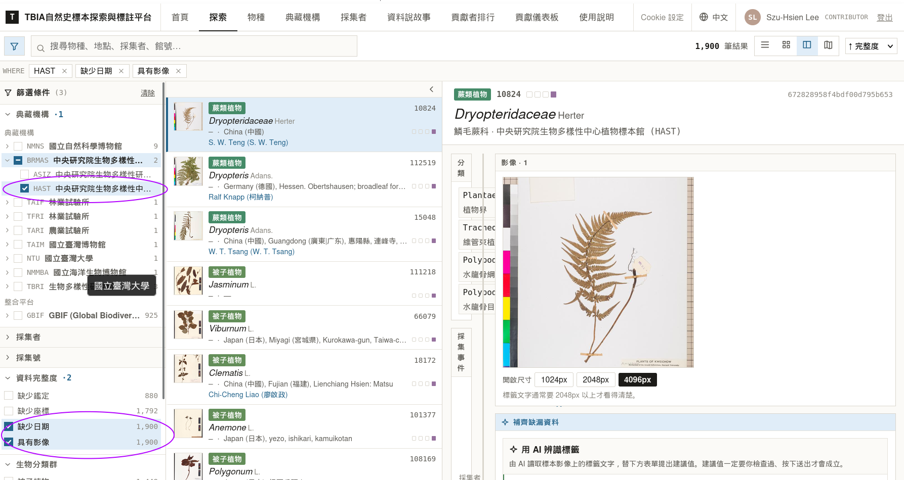
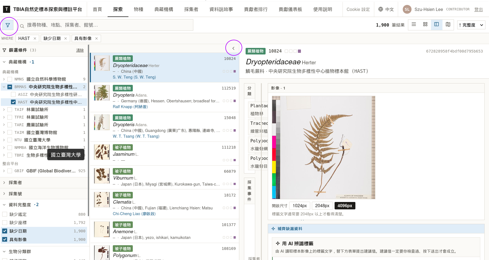
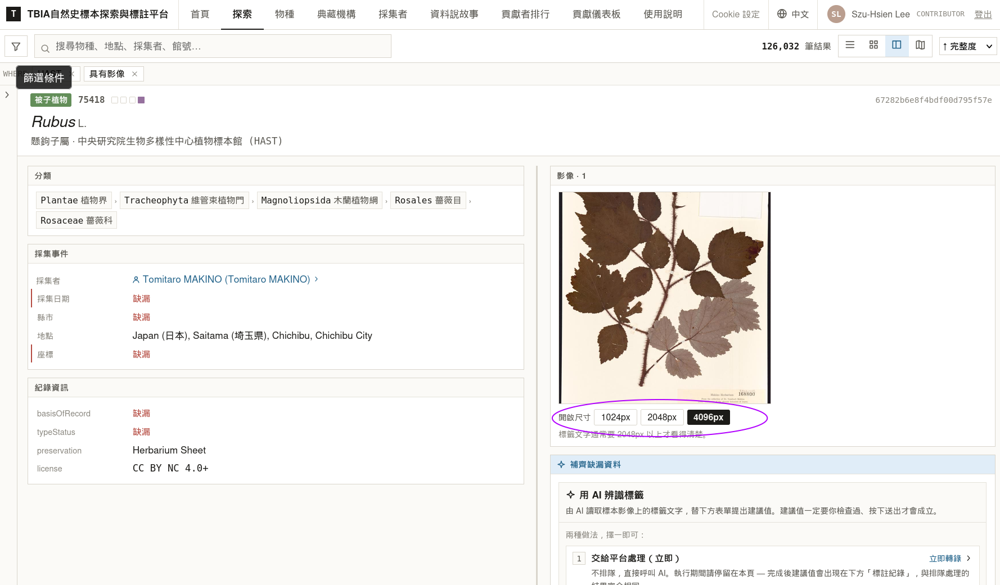
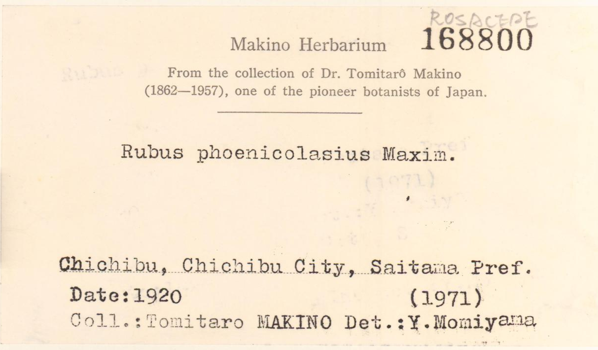
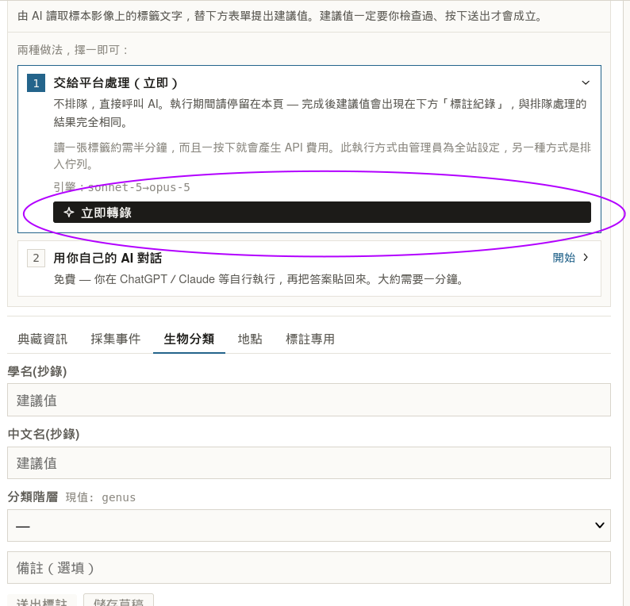
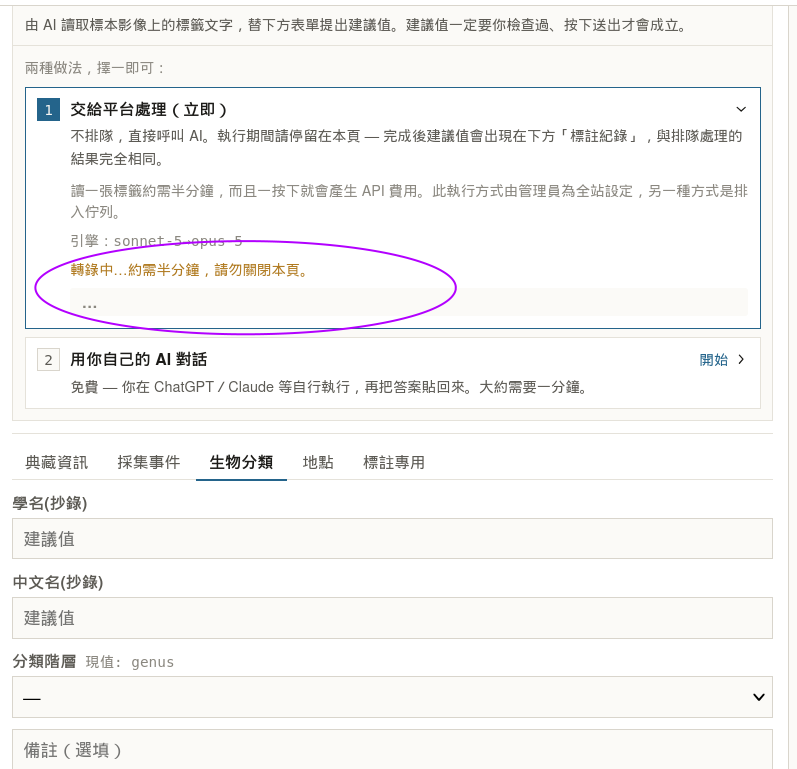
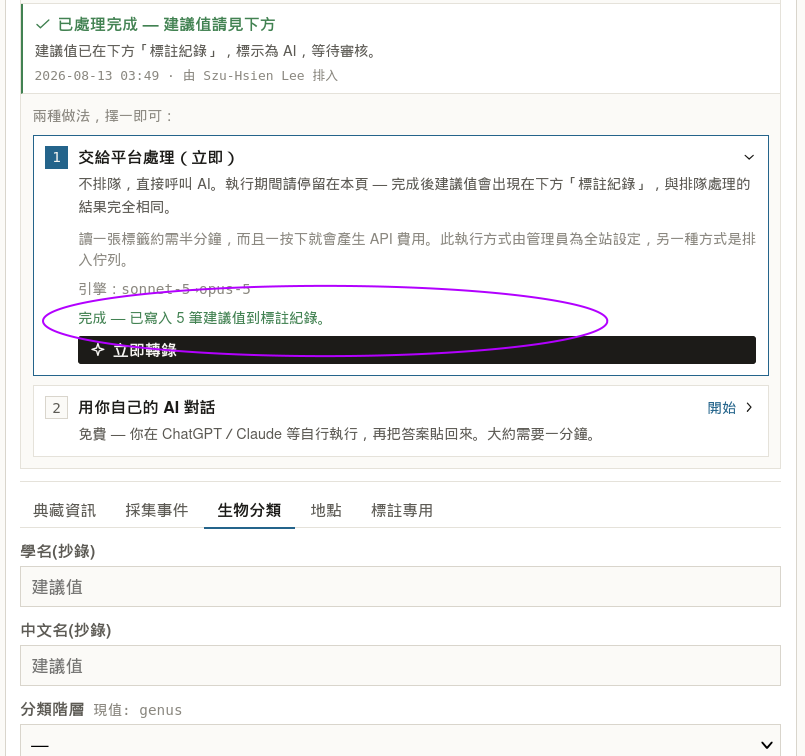
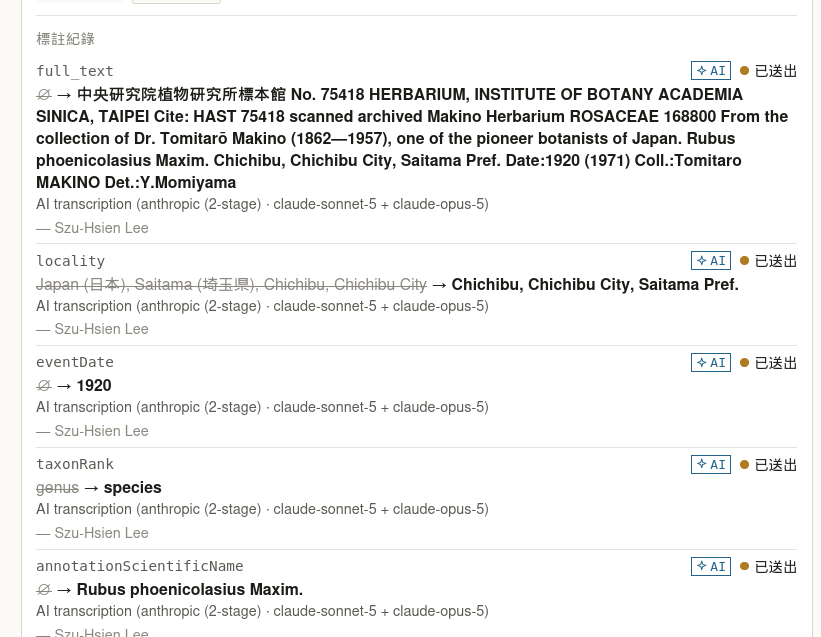
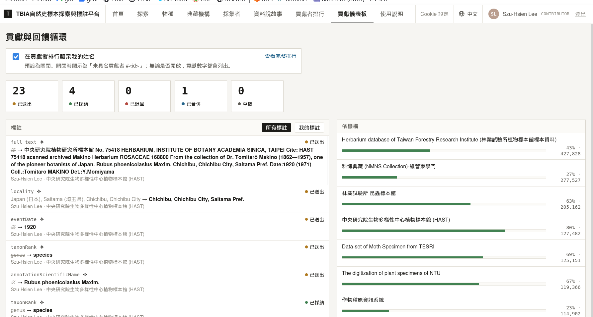

# 實做示範：用 AI 讀一張標本標籤

找一張標本、讓 AI 把標籤上的字讀出來、(人)檢查、送審(人審核)

---

## 1. 找一筆有照片、有標籤，但是標籤資訊還沒被數位化的標本

到**探索(Explore)**，左邊篩選條件預設有勾選 **具有影像**，資料完整度選擇 **缺少日期**，先以中研院植物標本館(**HAST**)為例。



隨便點一筆。

有可能電腦螢幕畫面太小，畫面格子會擠在一起，需要先把畫面空出來：左上角**漏斗**收起篩選、清單右上角 **`‹`** 收起清單。



現在左邊是原始資料，紅色字體「缺漏」就是我們要補的；右邊是照片跟標註區。

這一筆是 *Rubus* L.，採集者 Tomitaro MAKINO，**沒有採集日期**。

---

## 2. 先自己看一眼標籤

**別跳過這步。** 看一下要給 AI 看的東西，需要(人類!)確認對不對，看一下標籤上寫什麼。

照片下面有**開啟尺寸**：



- **1024px** — 資料庫原本給的。看得出是臘葉標本，但標籤讀不動
- **2048px** — 大部分標籤這個尺寸就夠了
- **4096px** — 手寫的、褪色的、字特別小的再用

選好點縮圖，就會用那個尺寸開新分頁。



```
Makino Herbarium  168800
Rubus phoenicolasius Maxim.
Chichibu, Chichibu City, Saitama Pref.
Date: 1920            (1971)
Coll.: Tomitaro MAKINO    Det.: Y. Momiyama
```

缺的日期經過OCR辨識成文字後，AI會去理解 **1920** 是一個年份。

---

## 3. AI 小幫手

目前提供 2 種AI讀取標籤模式，一個是用此標注系統內建的AI (最方便)，另一種是提供預設的提示詞 (prompt)，讓使用者直接複製&貼上到各自的AI聊天機器人服務 (ChatGPT/Claude/Gemini...)，再把回覆貼回這個系統，讓已經結構化好的資料自動寫入這個系統。

這邊示範第一種自動讀取模式：

往下捲到**補齊缺漏資料 → 用 AI 辨識標籤**，按**立即轉錄**。



⚠️ 按鈕一按下去系統就開始做，可能會等半分鐘。

note::
    看到的是**排入佇列**而不是「立即轉錄」的話
    有可能是系統的AI額度用盡，會排入佇列處理，交給批次程式跑，你按完就可以走，等等再回來看。

如果可以直接執行的話 **別關頁面**：



好了會告訴你AI寫了幾個欄位 (一個欄位算一筆)：



---

## 4. 檢查 ⭐ 最重點的步驟

建議值出現在下面的**標註紀錄**，每筆都標示著 ✦ AI。



刪除線是舊的、箭號後面是新的；🚫 表示本來是空的。拿它跟你剛剛看的標籤一項一項對：

| 欄位 | AI 給的 | 對嗎 |
|---|---|---|
| `full_text` | 標籤全文 | ✅ 逐字對得上 |
| `locality` | Chichibu, Chichibu City, Saitama Pref. | ✅ 標籤原文 |
| `eventDate` | 1920 | ✅ 標籤寫 `Date:1920` |
| `taxonRank` | genus → species | ✅ 有完整學名了 |
| `annotationScientificName` | *Rubus phoenicolasius* Maxim. | ✅ 標籤上的學名 |

**這張標籤上有兩個年份。** `Date:1920` 是採集年，後面括號的 `(1971)` 是後人鑑定（Det.）的年份。
AI 這次選擇了 1920，以個人判斷，前面有 Date:文字，寫在採集者旁邊，AI的判斷應該沒問題，這邊人類親自用他的知識與邏輯去判斷資料正確性，是這流程最重要的事。

如果覺得哪一筆不對，按**填入**把值帶進下面的表單，改成對的，再按**送出標註** —— 送出去的就是你改過的版本。

---

## 5. 送審之後

AI 寫的建議值狀態已經是**已送出**，接下來等審核者處理，不用再做什麼。

想看自己累積了多少、有幾筆被採納，到**貢獻儀表板**：



---

## 常見問題

**AI 讀錯了會不會把原始資料弄壞？**
不會。原始紀錄是唯讀的，你送的一切都只是附加在旁邊的建議，而且要審核過才算數。

**為什麼一定要先把照片放大？**
因為平台送給 AI 的也是放大過的版本。你跟 AI 看的是同一張圖，你的檢查才有意義 ——
你在 1024px 上看不清楚的東西，不代表 AI 也看不清楚，反過來也一樣。

**可以一次跑很多筆嗎？**
目前一次一筆。這是要花錢的操作，一筆一筆來也比較能確保每一筆都真的被人看過。
